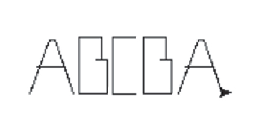
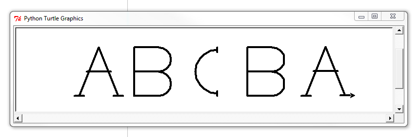

# ABCs

**Points:** 2.0
**Submission type:** online upload
**Allowed file types:** py

Write a program that has 3 functions: drawA(), drawB(), drawC() each draw a letter and advance the turtle on to where the next letter will begin. Once these functions are working correctly, have your program write "ABCBA"

The turtle functions mentioned so far above should be sufficient for this program as well. However, a full list of available built-in Turtle functions is here:

http://docs.python.org/2/library/turtle.html

**Extra Challenge:**

Try to design three functions -  drawA(), drawB(), drawC()  - that create a more complex typeface than what is pictured above. (Incorporate curves, block letters, etc...) For example:

