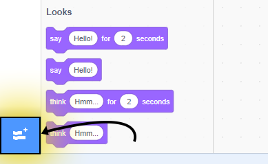
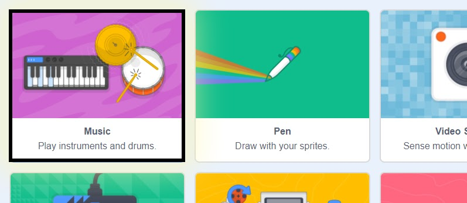
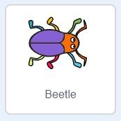
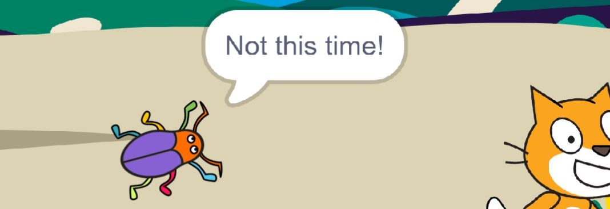
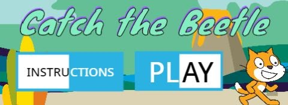

# Catch the Beetle

**Points:** 10.0
**Submission type:** online upload
**Allowed file types:** sb3

**Project Catch the Beetle!**

This project will be a simple game where the user is controlling a sprite that is trying to catch several computer-controlled beetles (or another a sprite, if you’d like!) on the screen.

Some blocks you may need to investigate for this project:

To compose music (rather than load a sound file), you’ll need another extension:

*To add an extension, first, find the “add extension” button in the bottom right corner*

*Then choose the extension called “Music”*

**

*The “touching” sensing block can both be used to detect if the current sprite is colliding with another sprite, or if it is colliding with an edge of the stage (choose from the drop-down).*

 

Basic Feature Requirements

*Completing the following basic features will allow for a maximum grade of 9/10. Also completing the Expert Challenges will account for the remaining mark.*

1. Create one or more scripts that allow the user to control Scratch the Cat (or another sprite of your choice) around the stage using the arrow keys ( ←↓→↑ ).
2. Add three more sprites, which will be the computer-controlled characters that you are trying to catch.
   - The beetle sprite works well, but feel free to choose what you’d like. Make sure to have**three separate sprites** like this.  
     
   - When the green flag is pressed, the beetles should begin moving on their own and bouncing off the edges.
3. When you begin the game (green flag) background music should begin (either a repeating sound file or a music script made in Scratch). Music should play until the program is stopped.
4. Whenever a beetle touches the edge of the stage, a**sound effect** should play before it bounces back onto the stage.
5. Two of the Beetles should be catchable. That is:
   - When Scratch reaches these beetles, Scratch should say “Got You!” and these two beetles should say “Oh No!” before being hidden from the stage.
   - The third beetle, however, should instead be placed at a random location, say “Not this time!”, and resume moving around the screen. This beetle will always get away!  
     
6. Pressing (and holding) the spacebar should make the Beetles go a bit crazy (Pepsi mode)
   - Beetles should move faster
   - Beetles should have an image/colour effect applied to them
   - Once spacebar is released, motion and appearance should return to normal
7. When the green flag is pressed, the beetles should begin moving on their own and bouncing off the edges.

**Expert Challenge Requirements**

1. Create your program so that it begins with a menu system  
   

- Include two options: Play Game and Instructions

- Instructions should load some information on the screen about how to play the game, with a button to return to the main menu.
- Play Game should start the game.

- Use broadcasts to control what happens when a menu button is selected
- Buttons must use at least 2 costumes and incorporate a hover effect (or similar).

*For a greater challenge, make the menu system controlled by keyboard (arrow keys to navigate and another key of your choice to make choice)*
