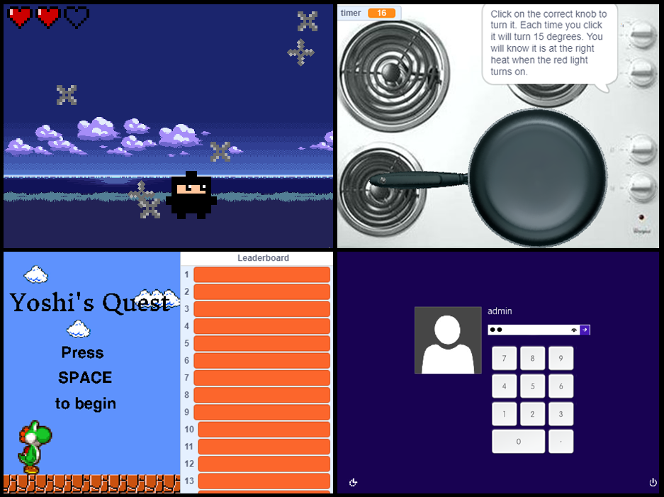

# Coolest Scratch Assignment

**Points:** 16.0
**Submission type:** online url,online upload
**Allowed file types:** sb3,zip

This is an open-ended assignment, where you will show some evidence of your learning in the class so far. There are just a couple of stipulations:

**Open-Ended Topic**  
  
For this project, you should create the coolest, most interesting thing you can in Scratch with what you’ve learned so far. This could be a game, an interactive program, or some sort of productivity software (a program that helps complete a task). Be sure to choose something that you’ll find interesting to work on for a full week!

**Included Concepts**  
  
This project is an opportunity to showcase all the concepts you’ve gained experience with over the past few weeks, and you must be sure to include all of the following *in some useful form*:

- Broadcasts
- Loops (must include both a **condition** and **counting** loop)
- Conditionals ( IF / ELSE )
- Variables
- A Function without inputs
- A Function with at least one input

**Complexity**  
  
As you're being given a full week to work on this project, its complexity should represent a 5-6 hours of dedicated work! Part of the grading rubric for the project will be that it’s complexity represents that amount of time commitment.

In this project, you should aim to *develop your skills* by exploring further an idea touched on in class (ie working with lists, clones), or something we didn't address at all. By the end of the project you should be able to describe something new you were able to accomplish in your program.

**Documentation**  
  
All programs should be accompanied by some form of documentation, which explains to users what the purpose of the software is as well as how to interact correctly with it. For this project, you'll need to submit a **minimum 1-page** documentation/reflection. Specific requirements can be seen in the module item ["Scratch Project Documentation"](../assignments/scratch-project-documentation.md "Scratch Project Documentation"). This is submitted separately from the Major Project, but comprises 20% of the overall project grade.

**Your Ideas, Your Code**  
  
Choose a topic/premise that you'll enjoy working on for several days, and I hope you'll have fun with this project! A few things:

- - This project should be of your own design. (Don't follow along with a tutorial or remix someone else's work)
    - However, the premise can be something you've seen elsewhere. *(For instance, planning to recreate the game "Battleship" is fine, as long as your version is made by you from scratch).*
  - You are welcome to look at others projects on the Scratch website to get ideas and study how they have made their projects, but you shouldn't have your program open at the same time.  
    - As well, If you take a specific idea from another project, video resource, or similar, you must attribute/cite it appropriately in your documentation.
    - **Failing to do so is plagiarism**, so please ensure to take care of this step if needed.

**Outcomes**

CP1, CP2, FP1, FP2, FP3
