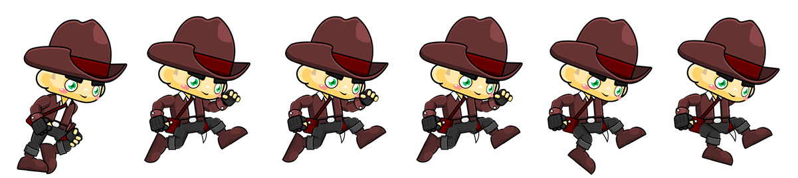
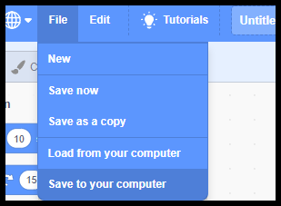

# Costume Changer

**Points:** 10.0
**Submission type:** online upload
**Allowed file types:** sb3

This program should showcase your ability to create more complex animations through the use of sprite costumes.  

**Base Features**

1. At least one sprite from the sprite library move around the stage autonomously (not controlled by the user) and cycle through its costumes appropriately. Make sure to choose a sprite that has more than one costume!
2. A sprite from a custom spritesheet should be controlled by user keyboard input (arrow keys).  
     
   - searching for "spritesheet" will yield many options. Refer to the videos below for how to rip images from a spritesheet and upload them to Scratch.
   - animate this sprite by cycling through costumes using a repeat (loop) block.
   - There must be at least 4 costumes in the animation that is continually being cycled.
3. If you are working on a computer without any graphics applications installed, there are web-based alternatives. One option is <https://www.photopea.com/>
4. Your program should use **two different backdrops**. One should be displayed when the sprite controlled by the user is on the left half of the stage, and the other should be used when that sprite is on the right half.

**Challenge Features**

1. Add 2 additional "actions" (additional sets of animation frames)  that are displayed through the use of different costumes and are activated by keyboard input.

   - When no buttons are pressed, an **idle animation** should continue to loop
   - You'll need to use some logic to distinguish between when *particular buttons are pressed* and *when those particular buttons are **not pressed...***

**Sample Output**

*A solution may look something like this example:*

**How to Rip images from a Spritesheet**  
Using Photoshop (if you have access to it):

Using Photopea (free, web-based):

**Submission Details**

For this project, you should submit your work as a **.sb3 file.**

You can download the sb3 file directly from the scratch editor.  **File → Save to your Computer******
