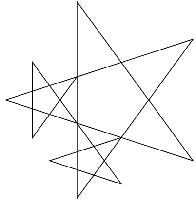

# Extra for Turtle Experts (Only is done all previous Assignments)

**Points:** 0.0
**Submission type:** none

If you've finished all the other, test your problem solving abilities with this one:

**Program Requirements**

- Create a function **drawStar()** to draw a star using the Turtle library in Python.
- This function can take any number of arguments you decide, but this function should be able to draw each of the 3 stars separately in the object below
- You need to use 3 function calls to create the image:  
  drawStar(args)  
  drawStar(args)  
  drawStar(args)

