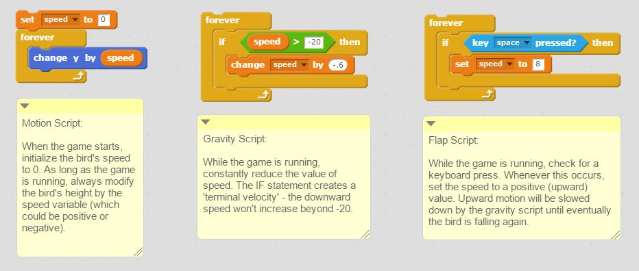
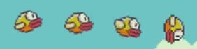

# Flappy Bird Clone [Extra for Experts]

**Points:** 0.0
**Submission type:** online url

As a class, we will create part of the Flappy Bird game. Once we have completed the base game, you'll be required to add some features on your own.

**Step One: Break down the game**

Let's view a sample video that shows the basic gameplay, and identify what our challenges will be and how we might accomplish them.

[Video](https://www.youtube.com/watch?v=AeBWZ-UZLyk)

**Step Two: Get some resources**

Download the following packs of images to work with:

[Flappy Images Basic.zip](../files/web_resources/Flappy-Images-Basic.zip "Flappy Images Basic.zip")

[Flappy Bird Extras.zip](../files/web_resources/Flappy-Bird-Extras-1.zip "Flappy Bird Extras-1.zip")

**Step Three: Basic Features**

The following three scripts will get you going in terms of building the basic mechanics. Note, no **event is attached to any of these scripts.** You may want to initially use "when green flag pressed", but only for testing purposes. Once you get into building the game with all the features, you'll need to use broadcasting to tell these scripts when to become active.

Once you have the basic motion of the bird down, the next main challenge is to create the pipes. I would suggest creating a general script (in the stage area) that uses random numbers to select which pipe should appear next. Once this has been decided, that sprite should create a clone of itself. Clones should appear on the right side of the screen and move across to the left side of the screen and be checking for a collision with the bird. When they reach the left side, the clone should be destroyed.

**Step Four: Build in some features on your own**

After we've made the basic game work, your assignment will be to add the following three features to make the program complete:

**1. Bird Direction**

If you watch the gameplay video again, you should notice that the bird faces different directions based on its current velocity. When the bird is moving up, it changes it points up. When it is going down, it points down in several different directions, depending on how fast it is falling. Using some **conditional statements,** implement this visual behavior into your game.

**2. Award Appropriate Medal**

Once the game is over, you should award a medal based on the score achieved. Use the following schema:

      0 - 10:    Bronze Medal  
      11 - 20:  Silver Medal  
      21+:       Gold Medal

Sprite images are provided in *Flappy Bird Extras.zip* above.

**3. Add Starting Sequence**

When the green flag is pressed, add an intro sequence that matches the sample video above:

- Title should be displayed with bird flying beside it
- Include the "Space to Start" option on the title screen. *You do not have to include Scores.*
- Hide the title, and replace it with the "Get Ready" image and the "Instruction" image
- Begin the game!

**4. When the game ends, allow the user to press start to play again**

- After the medal is displayed, display the "Space to Start" sprite, and allow that keypress to trigger the game restarting.

Once these features are all complete, share your project and submit the URL on Canvas.

**EXTRA CHALLENGES**

For those who are looking for an extra challenge (and want to develop the fully complete game):

**1. Add the fade-in / fade-out effect in starting sequence**

- Between the title screen and get ready screen, implement a fade-in and fade-out effect to match the sample video
- Also fade the instruction and get ready sprites in and out

**2. Legit score counter**

Using the built-in variable display for score is an easy solution, but it doesn't look great. Using the following font pack (images for characters 0-9), implement a script that will display the score in a more visually appealing format. [Numbers.zip](../files/web_resources/Numbers.zip "Numbers.zip")

*(see the "Countdown with Sprites" item in Modules if you need a bit of help!)*

**3. Extra difficulty?**

Presently our game difficulty stays constant until the player looses. Have your game increase in difficulty as the player gets to a certain score.

1. When the player gets past 10 points, add the chance for the pipes to move in the vertical direction as well. To accomplish this, you may want to use the following [modified sprite images.](../files/web_resources/moving-pipe.zip "moving pipe.zip")    *Scratch will resize the pipe to fit the stage vertically; you'll need to use the change size block to scale it back up.*

*2.*Fast pipes - have some small random chance that a pipe may move more quickly across the screen. Some people in the class did this by accident and found it created a pretty neat challenge for the user to navigate!

*3.*Be creative - come up with some devious way of increasing the difficulty (and hopefully enjoyment of the user)!
