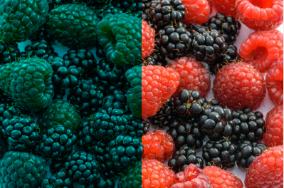
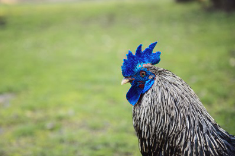
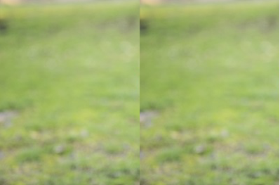
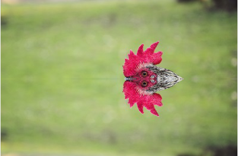
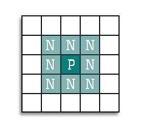

# Image Manipulator

**Points:** 10.0
**Submission type:** online upload
**Allowed file types:** zip

We've spent several days looking at how we can load and interact with images at the pixel level in Python by using a **nested loop.** Now it's your chance to implement a few different image effects on your own. For this assignment, you'll be asked to create solutions to four challenges from the CS20 Open Textbook: [3. Image Processing with Conditionals](https://cs20.ca/Python/MoreAboutIteration/ImageProcessingWithSelection.html)

*You'll be able to re-use much of the same base code for each project.*

**Complete the following four exercises (Base Features):**

- 3.4.1 No Red Left Side  
    
  
- 3.4.3 Change the Rooster Colour  
    
  
- 3.4.4 Repeat Left Twice  
    
  
- 3.4.6 Mirror Vertical  
    
  

*Don't forget a comment header and a few inline comments for each program!*

When submitting your work, please put all the files (python files and the image files being loaded) into a single ZIP file to submit.

**Extra for Experts:**

As a class, we'll do exercise 3.4.7 (Linear Gradient). For the extra for experts challenge, solve exercise **3.4.8: Radial Gradient**

**Extra for Extra-Experts:  (not required at this level, but a great challenge)**

Average Filter (Blur)

Create a program that will set each pixel to be the average value of *itself and its 8 neighbours.*This will create a blurring effect.

for any pixel (x,y), its neighbours are the 8 pixels that surround it:

which include (x-1, y-1),    (x-1, y),    (x-1, y+1),   (x, y-1),   (x, y+1),   (x+1, y-1),   (x+1, y),  (x+1, y+1)

**Hints:**

- You should be able to use a small nested loop to look at all nine pixels for each (x,y) position.
- Not all pixels will have neighbours in all directions (edge pixels). Start by only *blurring pixels that are not on the edge*
- If you are able to get that to work, think about how you could extend the logic in your loop to include edge pixels *(but for these, how to only look at neighbours that exist)*
