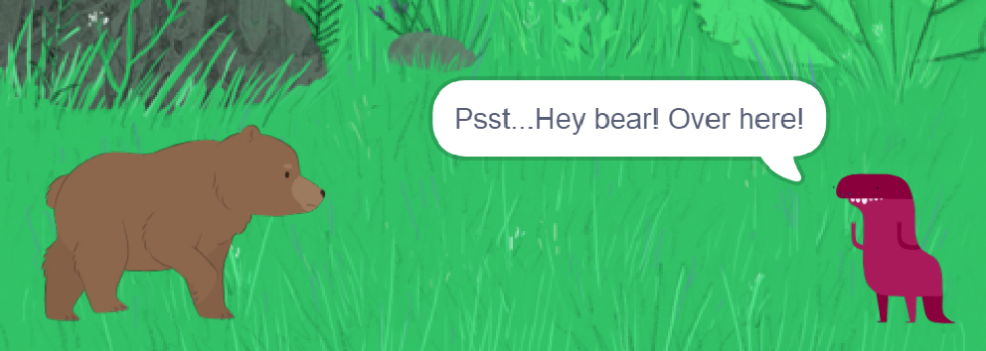
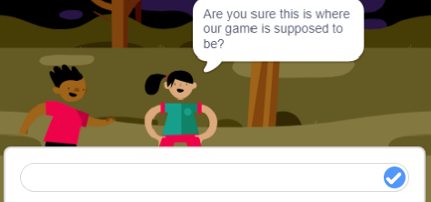

# Make an Interactive Short Story

**Points:** 5.0
**Submission type:** online upload
**Allowed file types:** sb3,zip

To experiment with *creating your own events* *with broadcasts and taking user inpu**t*, create an interactive short story or play. Create characters, experiment with moving sprites around the stage – it’s up to you!

****

**Base Features**

1. Within your story, you must include the following components:

   - At least one Backdrop
   - At least two characters
   - At least **five broadcast statements**

   Broadcasts must be named appropriately (“bear appears” rather than “message1")
2. Ask the user at least one question (using the ask block)

- - The **answer to this question** should be used in an IF or IF/ELSE statement so that the user’s response impacts what happens in the story.

**Challenge Features**

1. Incorporate a second user-input question that is used in a condition

- Using the **ask** block for user-input
- Using the answer block inside an **IF** or **IF/ELSE** blocks

2. Include some image or costume effects that are applied depending on the user’s input

**Outcomes**

CP1, FP3
