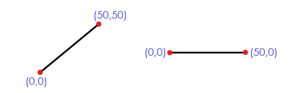
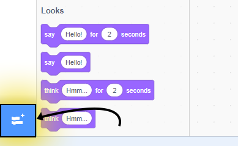
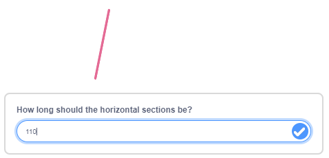
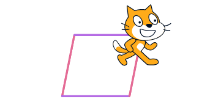
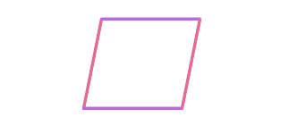
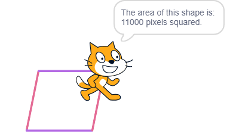

# Math Grapher

**Points:** 10.0
**Submission type:** online upload
**Allowed file types:** sb3

**Slope of a Line:**

The slope of a line tells us whether it is rising or falling, as well as how steep it is.  

*To complete this project, you’ll need to be able to calculate the slope of a line. Hopefully, this is a familiar operation, but if you’d like a refresher please check out the following video:*

**Adding the Pen Extension:**

For this project, you’ll need to add the pen extension as you did earlier.  
  
  
*To add an extension, first, find the “add extension” button in the bottom left corner.*

*  
Then choose the extension called “pen”.*

**Base Features Requirements**

1. Create a program that begins by asking the user for **4 inputs**, and stores each in its own **variable:**
   - A X-value for the first point of a line segment
   - A Y-value for the first point of a line segment
   - A X-value for the second point of a line segment
   - A Y-value for the second point of a line segment
2. Once this data has been stored, have a sprite (which can be visible **or** invisible) draw that particular line segment on the screen using the **pen blocks.**
3. Given the line drawn, **calculate the slope of this line** and store it in a variable.
4. Have your sprite report what the line's slope is for **2 seconds.**
   - If you've used the **hide block**, the say block won't show up on the stage!
   - At this point, either make sure to **show** the sprite, or use **set ghost effect to 100** instead; this hides the sprite but still allows text to be displayed.
5. At this point, the base features are complete!

**Challenge Features Requirements** *(Parallelogram Area Calculator)*A **Parallelogram** can be created with two sets of lines that are parallel to each other. Expand the program above to add a horizontal line to both endpoints of the user’s original line segment. Then, add a copy of the original line segment to the end of these horizontal segments to complete a parallelogram. Lastly, report the area of this closed shape. Some additional explanation is below:

1. Draw Original Line Segment - If you've completed the **base features** then this is already done! See more details up there...
2. Ask the user for a horizontal distance - store this value in a variable, then use it to draw two horizontal lines attached to each endpoint of the original line segment:  
   
3. Using that value, draw two horizontal lines segments of that length from each of the two existing endpoints (Remember, you should have these (x,y) locations stored in variables already)  
   
4. To finish the parallelogram, draw a line segment with the same length and slope as the first, but starting and ending at the free horizontal endpoints. (Note: the sprite that is enacting these scripts can be visible or hidden while drawing)  
     
5. Once the shape has been drawn, calculate what the area of the parallelogram is. If you don’t have the formula memorized (I didn’t!), you may need to do an internet search to find it. It is very readily available. Calculate the area and store it in an appropriately-named variable.
6. Lastly, have the sprite report what the area is. The sprite will need to be visible at this point in order for its speech bubble to be visible as well.  
   
