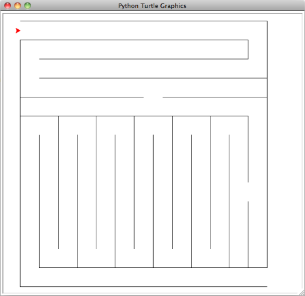

# Maze

**Points:** 0.0
**Submission type:** none
**Allowed file types:** py

Download the following program: [puzzle1.py](../files/web_resources/puzzle1-1.py "puzzle1-1.py")

The program uses a turtle to draw a simple maze. Write a program that navigates the turtle through this maze from start to finish. **You code can use no more than 36 lines to traverse the maze.** Look for any patterns in required movement, and try to reuse code or use loops!
