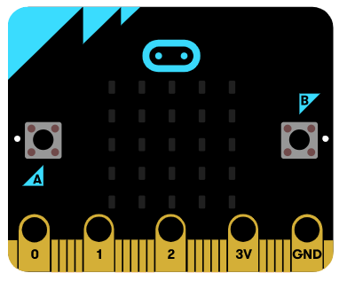
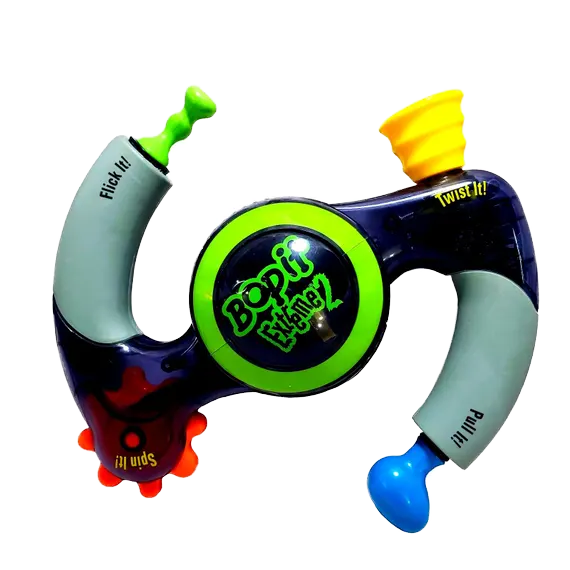

# Micro:Bit Game

**Points:** 10.0
**Submission type:** online upload
**Allowed file types:** py,zip

Use the examples we’ve done as reference, and create a game that uses the Micro:bit and functions!

For the type of game, choose **One**of the following three options:

**Option One: Bop-It!**

Using the **time library** as well as the **A**and **B buttons and Accelerometer** have the micro:bit display an A, B, or S, and the user must press the correct button or shake within a set amount of time.

- If the correct button is pressed within the time limit, award a point to the user and continue the game
- If the incorrect button is pressed or too much time is taken, end the game and report how many points the user earned.

- You can choose to either let the user keep playing until they make a mistake, or add a limit (the user wins the game if they get a certain number right in a row).

**Challenge Features:**

- Make the time limit to correctly press the button get shorter the further into the game you get. You could optionally give the user some 'difficulty' choice at the start that would set if this initial time is long or short when the game begins.
- Add two additional actions that the user could be asked to do: **Tilt Left** and **Tilt Right.** Represent these actions on the micro:bit display using the left and right arrow icons *(which are built-in images)* **← →**

**Starter Tutorial Video:**

If you are finding yourself stuck or not sure how to proceed further with this project, you may refer to the following tutorial video that leads through getting started with this project.

**Option Two: Time Guesser**

Using the **time library** as well as the **A**and **B buttons**, create a 2-player game where a number is displayed on the micro:bit, and each user presses their button (A or B) when they think that many seconds have elapsed.

- Let the user(s) choose the number of rounds to play (using **input()** or **FreeSimpleGUI**)
- For each round, users should get points depending on how close to the correct time they press their button.
  - Whichever user was closer should also get some amount of bonus points for being the closest that round
- Once all the rounds are done, display on the micro:bit the results:
  - how many points each player earned
  - who the overall winner is

**Challenge Features:**

- Use the micro:bit only for selecting the number of rounds to play at the start of the program
  - Display the default number of rounds as 5
    - If the user presses A, decrease the number of rounds
    - if the user presses B, increase the number of rounds
    - if the user presses A and B together, start the game with that number of rounds.

**Option Three: Your Choice!**

If you want to take on a more challenging option for this assignment, you can create an open-ended game project. The complexity of your game should be *equal to or greater than*  the two previously outlined options.

You can choose any game you'd like, but here are some possible ideas:

- have an “object” (led) fall from the top of the screen. The user needs to catch the object, and can move left/right by using the buttons or accelerometer. If they do not catch the object, the game ends.
- create a morse code visualizer, in which the user can type in a message, and the Micro:bit will display the message by flashing the LEDs using morse code. Another option would be to have the Micro:bit flash AND play beeps on your headphones ([see how to connect your headphones to the Micro:bit](https://makecode.microbit.org/projects/hack-your-headphones/make))
- A dice-based game, where shaking the microbit will roll the dice. This could be a 2-player game where each player can take a number of rolls to get as close to 31 as possible without going over to win the round. A game would be comprised of a set number of rounds, alternating which player goes first.
- You could create a game combining the micro:bit with the Turtle graphics library, where the micro:bit becomes the controller for the player. If you choose this option, you need to incorporate at least 2 different types of micro:bit components *(accelerometer, push buttons, display)*
- anything else you can dream up!

You can incorporate any of the demo code we did in class into your game, but note that the game must **expand** **on what we built as a class** in a meaningful way.

**Challenge Feature**

Creating a custom game (choosing option 3) will be considered to include the expert challenge component as long as the game's complexity is equal to the previous 2 options + their expert challenges. If you're unsure - just check with me!

**Some Past Student Examples:**

|  |  |  |
| --- | --- | --- |
| Micro-snake gif.gif | Flappy Bit.gif | space bit.gif |
| *micro:snake* | *flappy:bit* | *micro:invaders* |
