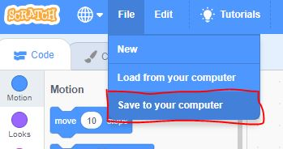

# Part Three: Python/Scratch Programming Challenge

**Points:** 40.0
**Submission type:** online upload
**Allowed file types:** py,sb3

For this programming challenge, choose *one* of the following problems to solve. You may use either Python or Scratch, but for full marks you must use python.

*If you choose to use Scratch to complete the challenge, your maximum mark on this section is 32/40 (80%).*

**Problem Choices**

There are two problems to choose from. Look carefully at both and choose the one you think you can solve most easily:

[Password Program](#unresolved-g6ed51d09df9980243bb1b248a7362675 "Password Program")

[Number Sequence](#unresolved-gd9d8c2e46c4a0a45f5a79b889de9245f "Number Sequence")

**Reference Material**

You are provided with one reference that you can utilize while creating your solution in Python.

[Python Quickref.pptx](../files/web_resources/Uploaded-Media/Python-Quickref.pptx)

No other websites or resources may be used!

**Grading Rubric**

This project is out of 40 marks, distributed as follows:

|  |  |
| --- | --- |
| well commented code throughout program | 6 |
| style (use of functions, variable names) | 14 |
| completeness (works correctly) | 20 |

**Extra Challenge:**

*If you finish early and have time, attempt the following challenge. If you complete it correctly, your lowest quiz mark will be omitted from your semester work.*

*[Fish Finder](#unresolved-g21c0a27a5cf91fc0d48fc77ce7646ff7 "Fish Finder")*

**Submission Details**

Please submit your Scratch or Python file (your solution to the Scratch/Python challenge) to me through this assignment.

**You may NOT use the web (other than the Scratch editor page)!!!**

If you are choosing to use Scratch: <http://scratch.mit.edu/>

**Do not publish your Scratch solution to the challenge!** To save your Scratch project to your computer so that you can upload it here, click File -> Download to Your Computer, as shown below:

