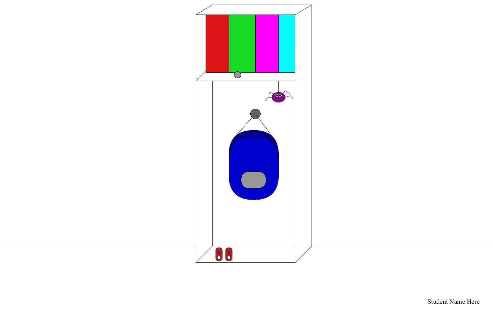
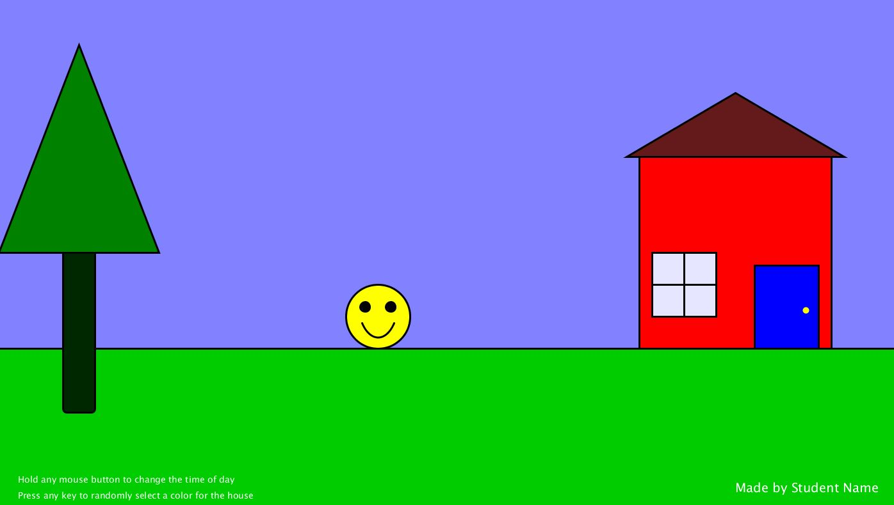

# Python Processing: Interactive Scene

**Points:** 10.0
**Submission type:** online upload
**Allowed file types:** pyde

**Before you Begin:**

|  |
| --- |
| You'll need a reference page to look up how to do certain operations for this project. **[The Python Processing Reference page](https://py.processing.org/reference/)** should be open in a tab whenever you are working on this project. In particular, you'll be most interested in the **Shape (2d Primitives), Typography (text), Color (setting), and Input (mouse and keyboard)** sections. |

  

Interactive programs run continually and produce output that often is influenced by user input of some form. For this project, you will create an interactive scene, where the displayed contents of the window will depend on user input. There are three basic requirements for you to fulfill:

**Base Requirements:**

*Draw a scene of your choice. It could be a winter scene, on the moon, or at the zoo.*

- The must be at least one character in the scene
- Make sure to use at least one *(but likely many more)* of each primitive shape (line, rect, ellipse)
- Use appropriately named variables when constructing the visual elements to allow for their location or size to be easily changed.
- Display your name [(as text)](https://py.processing.org/reference/text.html) on the sketch in one of the bottom corners.
- Allow the user to influence the sketch's visual appearance through both keyboard and mouse input:  
    
  - Mouse: Have the mouse impact the drawing. This may mean a character is following the mouse, or that some other aspect (color, size, ??) of an element changes depending on the location of the mouse. This is requirement is left intentionally vague to allow for artistic freedom - be creative!
  - Keyboard: Have some keypress(es) impact the drawing. This could be as simple as a giant 'reset' button to revert the drawing to its initial state, or could be something more complex - be creative!

**Expert Challenge:**

- Variables can be used to represent states. The most common usage is a Boolean, where a variable can only occupy one of two states (True or False). Integers can be used in the same way, if a developer ensures that only two different values are ever stored in that variable. (Typically using 0 and 1). If we want more than two possible states (or values) for a variable, an integer is a suitable choice.

  Create a variable called **current\_back** that will act as a 3-state variable (can only be equal to 0, 1, 2). Use this variable to control the background of your scene - a different background should be drawn depending on the value stored in that variable. Whenever the user right-clicks the scene, change **current\_back** to the next value:

  ( 0 → 1    1 → 2     2 → 0).

  This should allow the user to cycle the background color with a right-click interaction.

**To Hand In:**

As with all your other Python projects, make sure to include a **Comment Header** and **Inline Comments.** Once this is complete, submit your **.pyde** **file**
