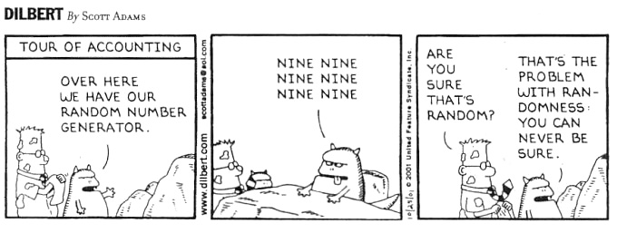

# Random Assignments (very unpredictable!)

**Points:** 10.0
**Submission type:** online upload
**Allowed file types:** py

Actually these assignments aren't that "out-there", they just have to do with using the random library! Two programs, to complete and submit as .py files:

**1. Guess.py:**

Create a program that generates a random number between 1 and 100. Prompt the user to guess what the number is, and keep track of how many times the user has guessed. Allow the user to guess up to five times.

For each guess, report if the guess is too low or too high and how many guesses remain. If the guess is correct, congratulate the user and end the program.

**2. Bubbles.py:**

Create a program (using Turtle graphics) that generates 200 circles of random size and color, and draws them at random x,y coordinates.

*Hints: remember that turtle.up() stops the turtle from drawing, and turtle.down() starts the turtle drawing.*

*if may help to define a function such as drawCircle(x,y,size)*

**3. no\_teen\_sum.py:**

Given 3 int values, a b c, return their sum.

However, if any of the values is a teen -- in the range 13...19 inclusive -- then that value counts as 0, except 15 and 16 do not count as a teens.

Write a separate helper "def fix\_teen(n):     "that takes in an int value and returns that value fixed for the teen rule. In this way, you avoid repeating the teen code 3 times (i.e. "decomposition").

After you've created the function, call the function with 3 random integers between 0-25.
