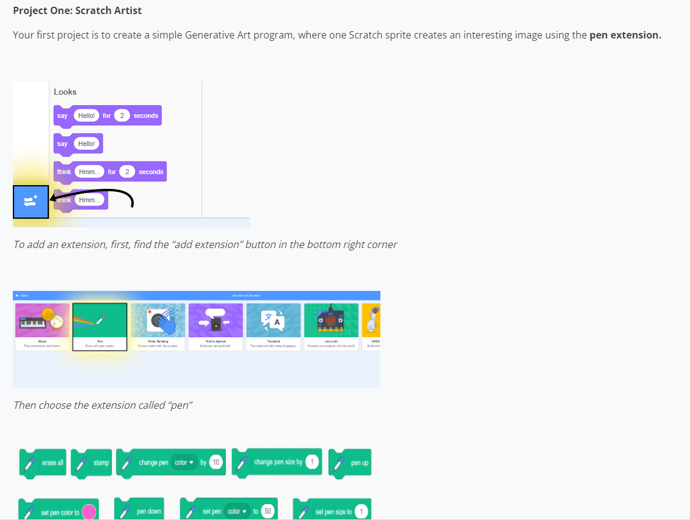
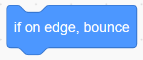
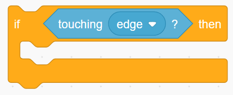

# Scratch Artist

**Points:** 10.0
**Submission type:** online upload
**Allowed file types:** sb3

This will add all of the pen blocks that you’ll need for this project.

**Base Feature Requirements**

*Completing the following basic features will allow for a maximum grade of 9/10. The remaining Challenge Features will account for the remaining 1 mark.*

1. Create a program that features one sprite (choose any that you want). When the green flag is pressed, this sprite should begin at the origin (0,0), and choose a random direction to move automatically

   - As it moves, it should use the pen to draw a trail of its motion.
   - Whenever an edge of the stage is encountered, the sprite should bounce.
   - Movement must use the **move** **block.**  No glides or goto blocks for this feature.

2. This project should include both **background****music**as well as **sound****effects**.

   - When the green flag is pressed, start some background music. This should play continually until the user stops the program.
   - Have a sound effect play whenever the sprite bounces on the edges of the stage  
           HINT:   The  is needed, but you have your program handle the sound effect **first.** This is because the "bounce" action spins the character and often they will no longer be touching the edge. Use  to help with adding a sound effect each time the sprite runs into the edge of the stage.

3. Allow the pen characteristics to be modified by the user as follows:

   - The**Z key** will decrease the size of the pen
   - The**X key** will increase the size of the pen
   - The**C key** will change the colour of the pen
   - The**R key** will reset the drawing (erase all)

**Challenge Features**

1. Add a second sprite into the sketch, whose **movement will be controlled by the user**.

   - Use the four arrow keys (  ↑ ← ↓ → ) to control the sprite’s x-position and y-position.
   - Use pen commands to make this sprite draw a line wherever it moves
2. Allow this sprite’s **pen size** and **pen colour** to be changed whenever this sprite touches the other (bouncing) sprite, according to the following scheme:
   - If the user-controlled sprite is on the left half of the screen:
     - Change the pen size by 2
   - If the user-controlled sprite is on the right half of the screen:
     - Change the pen colour by 10
