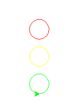

# Stop Lights

**Points:** 2.0
**Submission type:** online upload
**Allowed file types:** py

Design a program that draws 3 circles of different colors in a vertical line.

- The circles should be red, yellow, and green from top to bottom
- The diameters of each circle should be equal.
- Implement this program by creating a function called **drawCircle()** that takes 3 parameters (x, y, c) where x and y are co-ordinate locations of the circle's center and c is the color to draw the circle.

You may need to use turtle.up(), turtle.down(), turtle.goto(), turtle.color(), and turtle.circle()

