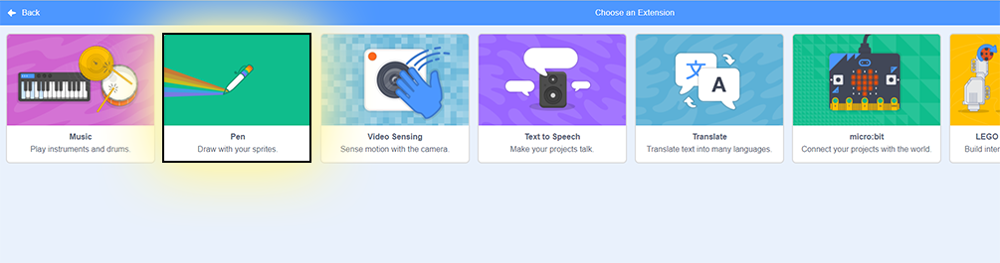
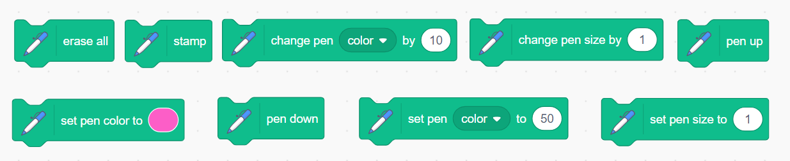
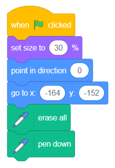
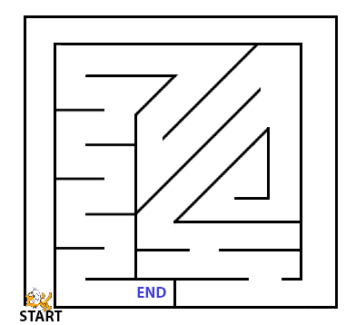

# The Labyrinth!

**Points:** 10.0
**Submission type:** online url,online upload

In this assignment, you'll need to devise an **algorithm** to help the Scratch cat exit a labyrinthine maze. Remember what you've learned about using loops (repeat blocks) - these can clean up repeated code sections and make our programs much easier to understand.

Before you Begin:

This project requires that we add the **pen extension** to Scratch.

*To add an extension, first find the “add extension” button in the bottom left corner*

**

*Then choose the extension called “pen”*

**

*This will add all of the pen blocks that you’ll need for this project.*

Assignment (Base Requirements):

1. Download the following maze image: [Maze.jpg](../files/web_resources/maze.jpg "maze.jpg") and upload it to Scratch as a background for a new project.

2. Create the following starting blocks to ensure our scratch cat starts at the same location each time:

3. Help move the cat to the end location without crossing any of the labyrinth walls. To receive full credit for this assignment, you must be able to accomplish the task cited above **without using more than 40 blocks**(including the 6 setup blocks shown in #2).

**A FEW RULES:**

There are several blue MOVE blocks that allow you to solve this using coordinate locations. One of the goals of this challenge is to come up with an elegant solution through use of loops. To facilitate that, **the only blue movement blocks allowed are:**

**Move             Turn               Point in Direction**

*Expert Challenge*

Finishing it with 40 blocks was too easy? Take a closer look at your algorithm and the maze and see if you can come up with any **optimizations**to your solution. To earn the extra for experts challenge on this assignment, design a complete algorithm that uses less than 32 blocks (including the 6 start-up blocks).

What is the most concise solution you can devise? *The current shortest student solution is 26 blocks (including the 6 setup blocks).*

*edit: Actually students have solved it with even less! 26 is likely the minimum with a straightforward approach. It is possible to tackle the problem in a few different ways that allow for even shorter solutions...*

**Outcomes**

CP1, FP2, FP3
