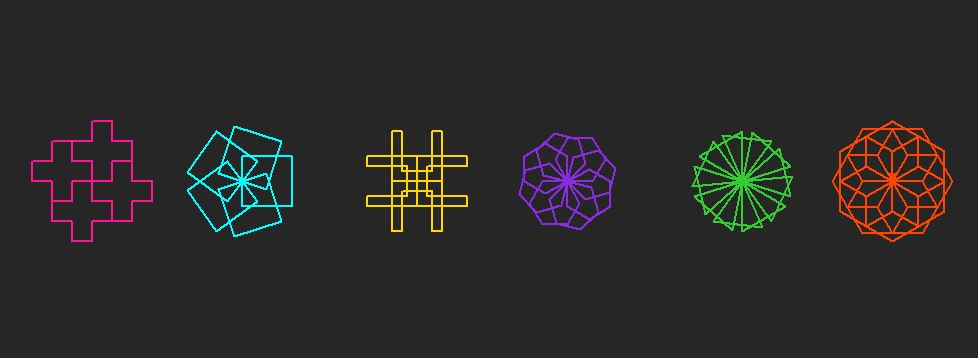

# Turtle Confusion 1

**Points:** 10.0
**Submission type:** online upload
**Allowed file types:** py

For this turtle graphics challenge, create a program that creates uses the **turtle library** to draw all of the following shapes on **in a single window**.

You may want create a window that is bigger than the default one. To do this, you can use the .setup() function:

wn = turtle.Screen()  
wn.setup(800,400)    #makes the window 800 pixels wide and 400 pixels high

*Don't forget your header, inline comments, and to make sure you are using functions and loops to make your code elegant and efficient.*

Extra for Experts:

Also include the following, more challenging image:

Need Even More Challenges? Just to Challenge your brain:

**HINT:**  If needed, click here to see some *general advice* for how to approach this problem...

**Planning:**

- - - Identify Simple Shape
    - Identify Pivot (common point for all simple shapes)

**Coding:**

- - - Move turtle to where you want to draw the shape
    - Write a function to draw simple shape only
      - start/end at same spot
      - start/end facing same direction
    - Use a loop to draw simple shape \_\_\_ times
      - rotate turtle \_\_\_ degrees after each shape
