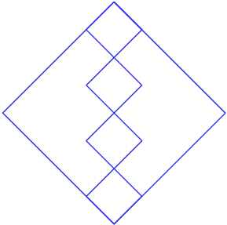

# Turtle Confusion 2

**Points:** 0.0
**Submission type:** online upload
**Allowed file types:** py

**Loops Quiz Replacement:** If you were not satisfied with your result in the loops quiz, completing this optional assignment can serve as further evidence of your understanding of loops (and can replace the loops quiz grade).

Turtle Confusion, part two! Remember that complex problems can often be reduced (or deconstructed) into several smaller and simpler sub-problems. As in the previous assignment, create a program that creates uses the **turtle library** to draw all of the following shapes on a single window.

*Don't forget your header, inline comments, and to make sure you are using functions and loops to make your code elegant and efficient.*

**

Extra for Experts:

Also include the following, more challenging image:

Need Even More Challenges? Just to Challenge your brain:

