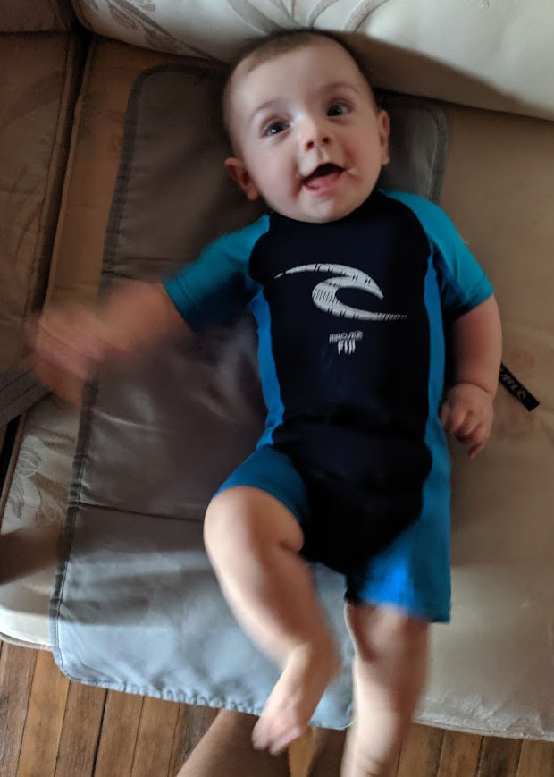

# About Yourself

*Discussion Topic*

Your first assignment is to tell the rest of the class a little bit about yourself. We are going to be spending a bunch of time together this semester, so it would be nice to get to know each other. I'll start:

- I really enjoy playing sports (basketball, soccer, football, badminton, spikeball, tennis, you name it!)
- I teach Computer Science, Drafting, Digital Media Production, and Robotics this year. Recently I've also taught Graphic Arts, Photography, and Math.
- I'm quite interested in Sailing and Windsurfing, and bought a 1978 Hobie 16 that I'm try to get on the water as much as possible.
- Recently my wife and myself had our first child, a son named Roscoe! He loves to smile and is a lot of fun  
  

How about you? What makes you tick? What are you looking forward to in this class?

*If you've already taken a class from me, then think of something new I don't already know!*  
[Administrivia note: this is marked simply as complete/incomplete]
