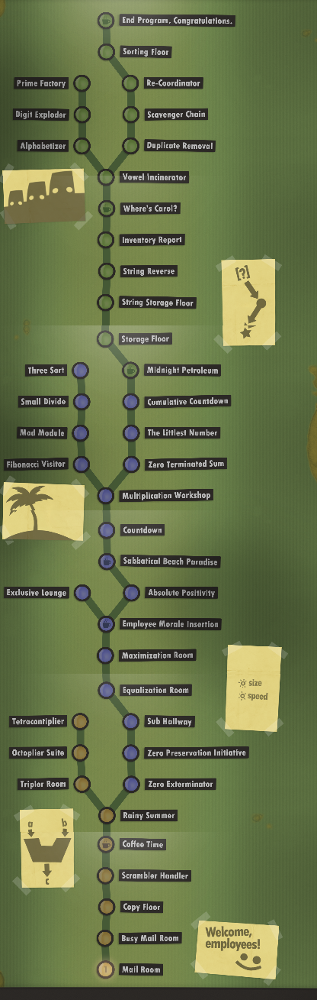

# Human Resource Machine Exercises

We recently tried **Human Resource Machine** as a group for part of class. This puzzle-programming game is an excellent way to sharpen our logical reasoning and computational thinking skills. We will spend a little bit of time each class for the next few weeks to work our way through the program.

Although the *syntax* used in this program is a simple language (not Python), there are some strong parallels to the main concepts of learning to code in this class, and completing this program will help improve your ability to break problems down and articulate solutions through code.

This activity will be graded on a **Mastery basis.** Of the total **42 nodes** (circles) available on the level map (see left), each will be marked as complete when you finish it. There are additional efficiency (space and speed) challenges that you may attempt for each challenge, but these are not required to be completed.

**Grading on this project will be as follows:**

|  |  |
| --- | --- |
| **Number of Exercises Complete** | **Grade** |
| 42 | 100 |
| 39 - 41 | 95 |
| 35 - 38 | 90 |
| 31 - 34 | 80 |
| 27 - 30 | 70 |
| 23 - 26 | 60 |
| 19 - 22 | 50 |
| < 18 | < 50 |

*Some students will finish earlier than others. More time will be given after this point to ensure all students have sufficient opportunity to make their best progress possible. Early finishers will have a new challenge to attempt during those times.*
