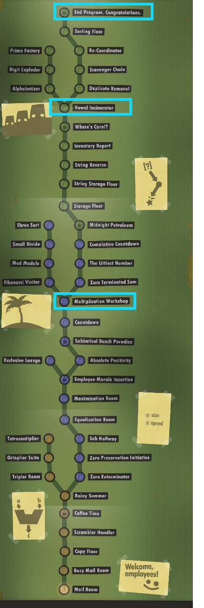

# QUIZ REPLACEMENT: Human Resource Machine

We recently tried **Human Resource Machine** as a group for part of class. This puzzle-programming game is an excellent way to sharpen our logical reasoning and computational thinking skills. You are invited to work further through this program if you find yourself ahead during class, or on your own time.

To try something  new, this year if you complete up to **certain milestones** in the program, this progress can replace one of your Scratch Quizzes (bring it up to full marks). Reaching these milestones will require demonstration of the same sets of knowledge, so this is really a second opportunity to show your learning in these areas.

The primary value, of course, won't be an increase in your grade, but the practice required to reach these milestones will better equip you for further success as we continue on in the class!

**Milestones:**

1. Complete *up to and including:* Multiplication Workshop
2. Complete *up to and including:* Vowel Incinerator
3. Complete *up to and including:* End Program (Complete the whole game!)

\* to complete a milestone, all preceding exercises (left and right path) should be complete!

\*\* to bump up the **Scratch Summary Quiz**, you need to reach at least the second milestone (as this quiz is comprehensive and covers all the related concepts)

When you've completed a milestone, call me over to your computer in the lab to show me your progress. I'll bump up your lowest current Scratch Quiz.
