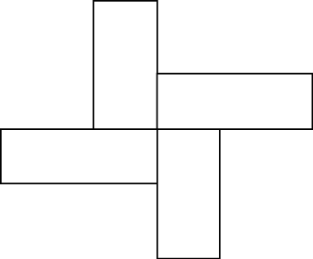

# Turtle Graphics - Challenges Demo

As a class, let's look at some turtle graphics challenges. Once we work through these together, you'll be presented with a series of challenges (in increasing difficulty) to test your understanding of loops, conditions, and your problem-solving skills!

**1. Polygons**

Using **for** loops, let's create the following regular polygons. (Side lengths all equal, angles all equal)

- Triangle (3)
- Pentagon (5)
- Nonagon (9)
- Triacontagon (30)
- Circle?  (Convergence of Regular Polygons and Circles...)

**2. Combination Shapes**

Using many copies of simple shapes, we can build up much more interesting visuals. Think functions and loops!

     
