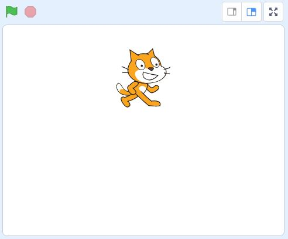
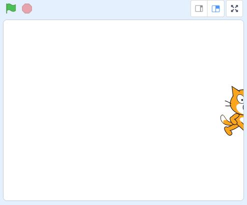
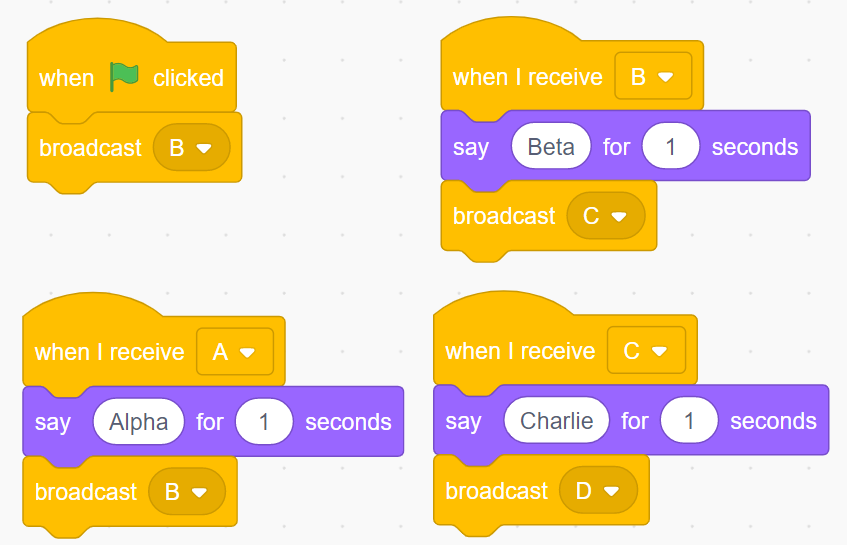

# Practice Quiz One:  Stage, Broadcasts, Sounds

*Quiz*

**Points:** 6.0

This practice quiz is connected to our first few days of class, and will help prepare you for the first graded quiz!

## Questions

### Question 1

**Scratch - Stage**

Assuming a stage width of 480 and a stage height of 360, what is the current y-position of Scratch?

- [x] 90
- [ ] 0
- [ ] 360
- [ ] -180

### Question 2

**Scratch - Stage**

Assuming a stage width of 480 and a stage height of 360, what is the current **x-position** of Scratch?

- [x] 240
- [ ] 480
- [ ] -120
- [ ] 0

### Question 3

**Question**

What type of program behavior would you expect to happen when the following script is manually activated?

- [x] Short movement by sprite and a possible rotation.
- [ ] Sprite will move back and forth across the screen.
- [ ] Sprite will move across screen and turn 90 to the right each time it hits a wall.
- [ ] No action

### Question 4

**Scratch - Broadcast Events**

Predict the behavior of the following scripts when the green flag is clicked.

- [x] The sprite will say "Beta" followed by "Charlie"
- [ ] The sprite will say "Alpha", followed by "Beta", followed by "Charlie"
- [ ] The sprite will say "Charlie" only
- [ ] The sprite will say "Beta" only
- [ ] The sprite will say "Alpha" only
- [ ] The sprite will continuously say "Alpha", "Beta", "Charlie" over and over forever.
