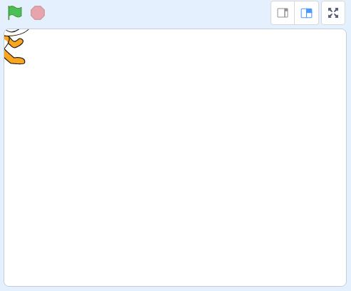

# Practice Quiz Two:  Basics, Decisions, and Loops

*Quiz*

**Points:** 4.0

Use this practice quiz to test your understanding of the introductory ideas as well as **conditional statements** and **looping structures.**

## Questions

### Question 1

**Stage - Location**

Assuming a stage width of 480 and a stage height of 360, what is the current x-p[o](../files/web_resources/W01-Q-08.JPG "W01 - Q - 08.JPG")sition of Scratch?

- [x] -240
- [ ] 120
- [ ] -120
- [ ] 240
