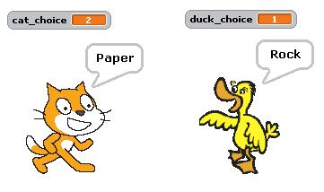

# Rock, Paper, Scissors: Choices

*Quiz*

**Points:** 3.0

## Questions

### Question 1

**What does the character say if their choice is 1?**

We want two characters to be able to play the game of *Rock, Paper, Scissors* against each other. We will do this by making a variable for each character that stores a number. They store a random number between 1 and 3 into this variable. Based on this number, they say the corresponding word. An example run of the code is shown below:   
  

Based on the diagram above, what does the character say if their choice is 1?

*(Short answer / fill-in-the-blank question)*

### Question 2

**What does the character say if their choice is 2?**

Based on the diagram above, what does the character say if their choice is 2?

*(Short answer / fill-in-the-blank question)*

### Question 3

**What does the character say if their choice is 3?**

Based on the diagram above, what does the character say if their choice is 3?

*(Short answer / fill-in-the-blank question)*
