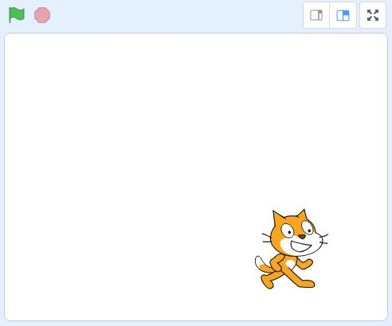
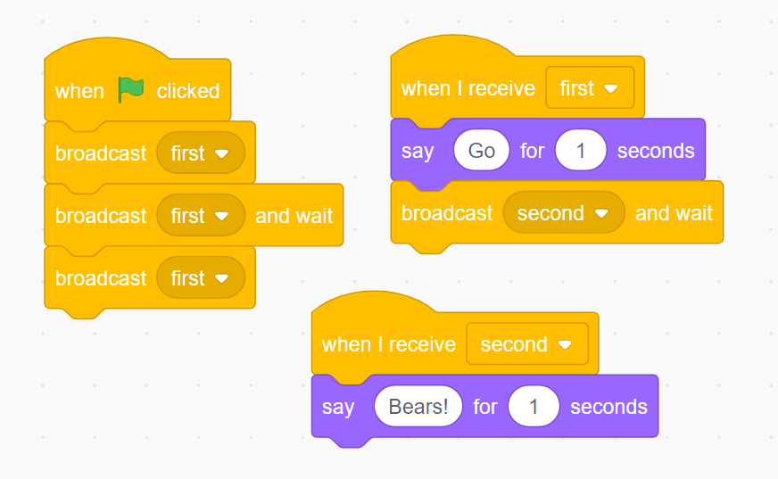
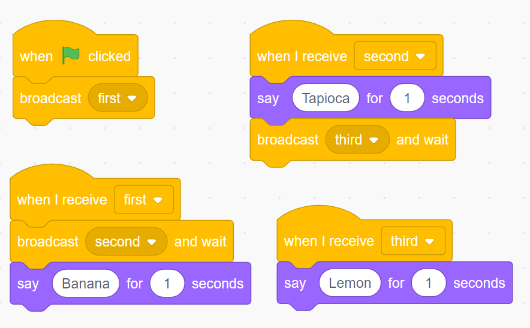

# Scratch Quiz One: Stage, Broadcasts, Sound

*Quiz*

**Points:** 5.0

A quiz to check your understanding of the the basics of the Scratch environment.  Solve only with your brain!

## Questions

### Question 1

**Scratch - Stage**

Assuming a stage width of 480 and a stage height of 360, what is the current y-position of Scratch?

- [x] -90
- [ ] 90
- [ ] 180
- [ ] -180

### Question 2

**Scratch - Stage**

|  |
| --- |
| Assuming a stage width of 480 and a stage height of 360, what is the current y-position of Scratch? |

- [x] 0
- [ ] 240
- [ ] -180
- [ ] 180

### Question 3

**Scratch - Broadcasts**

Predict what will be said (and in what order) by the sprite that has the following scripts (when the green flag is pressed),

- [x] Go Bears! Go Bears!
- [ ] Go Bears! Go Bears! Go Bears!
- [ ] Go Go Bears! Go Bears!
- [ ] Go Bears!

### Question 4

**Scratch - Broadcasts**

When the following scripts are activated, what will be said by the sprite (in the correct order, of course!)

- [x] Tapioca  Lemon  Banana
- [ ] Lemon Tapioca Banana
- [ ] Tapioca Banana Lemon
- [ ] Lemon Banana Tapioca
- [ ] Banana Tapioca Lemon
- [ ] Banana Lemon Tapioca
