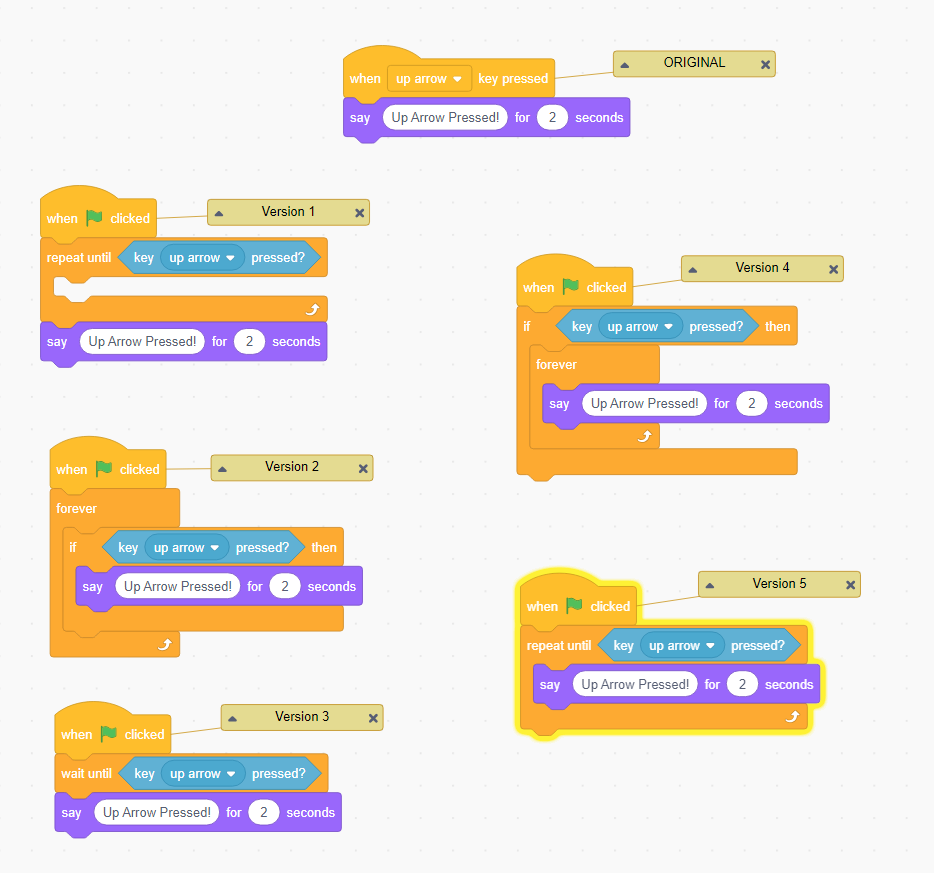
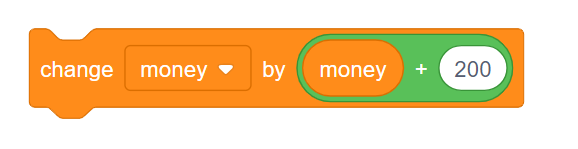
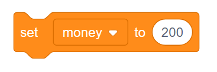
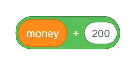
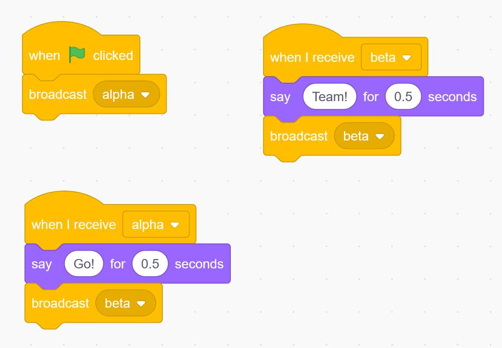

# Scratch Summary Quiz

*Quiz*

**Points:** 14.0

This quiz will test your knowledge of what we've covered in Scratch so far.

## Questions

### Question 1

**Coordinate Systems**

Assuming a stage width of 480 and a stage height of 360, what is the current x-position of Scratch?

- [x] 0
- [ ] 120
- [ ] -120
- [ ] -240

### Question 2

**Keyboard Input**

Which versions shown below provide the same functionality as the Original script, where the character will say Up Arrow Pressed for two seconds every time the up arrow key is pressed?

- [x] Version 2
- [ ] Version 1
- [ ] Version 3
- [ ] Version 5
- [ ] Version 4

### Question 3

**Variables**

Let us say that you are trying to create a program that lets you play *[Monopoly](http://en.wikipedia.org/wiki/Monopoly_%28game%29)* on your computer. You will probably want to use a variable to keep track of how much money you have as the game progresses. In *Monopoly*, each time you pass the Go square, you get $200. If you are keeping track of your money in a variable, which of the following blocks would be most appropriate for changing the amount of money you have when you pass Go?

A. 

B.

C. 

D. 

- [x] B
- [ ] A
- [ ] C
- [ ] D

### Question 4

**Variables**

In Scratch, there are two different types of data that can be stored in variables. What are these two types?

*(Short answer / fill-in-the-blank question)*

### Question 5

**Broadcasting**

Describe what will happen when the green flag is pressed.

*(Short answer / fill-in-the-blank question)*
