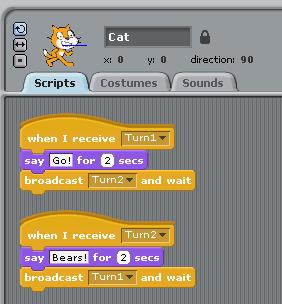

# Test Yourself: Broadcasting Go Bears!

*Quiz*

**Points:** 0.0

## Questions

### Question 1

**Predict the behavior**

Without trying this in Scratch, try to answer the following question:   
  
 What does the following set of scripts for the Cat do when you click on the When I receive Turn1 script?

For this and other self-tests, once you answer, you will be able to see the correct answer and a quick explanation.

- [ ] Nothing happens - this does not work.
- [ ] The Cat says "Go!" and then "Bears!" once.
- [ ] Not quite! You can see the how turn 1 and turn 2 are listening for each other, this creates what we call an <strong>infinite loop</strong>.
- [x] The Cat says "Go!" and then "Bears!" until you hit the red Stop button.
