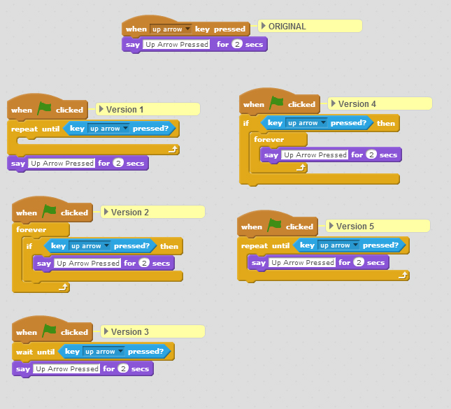

# Test Yourself: Detecting a key press

*Quiz*

**Points:** 0.0

## Questions

### Question 1

**Up Arrow Pressed - Which versions work?**

Which versions shown below provide the same functionality as the Original script, where the character will say Up Arrow Pressed for two seconds every time the up arrow key is pressed?

- [x] Version 2
- [ ] Version 1
- [ ] Version 3
- [ ] Version 4
- [ ] Version 5
