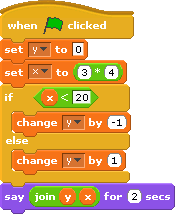
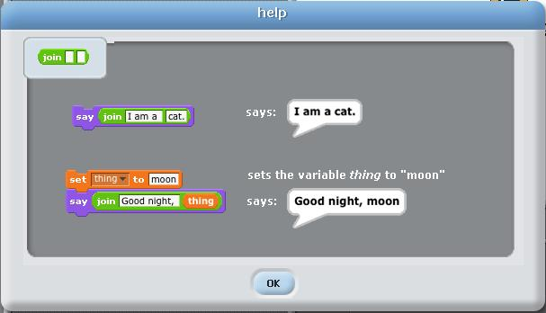

# Test Yourself: If - What would you expect?

*Quiz*

**Points:** 1.0

This is not graded - see if you can predict what would happen!

## Questions

### Question 1

**Question**

Consider the following script:

The help screen for the join block is provided below, in case you need it.

What is the value of x at the end of the script above?

- [x] a
- [ ] as
- [ ] sd
- [ ] No answer text provided.
