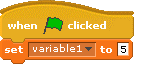
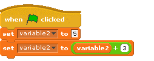
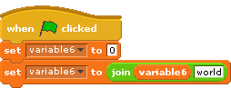
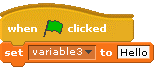
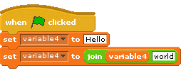
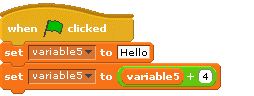

# Test Yourself: Non-numeric variables

*Quiz*

**Points:** 6.0

So far we've just been using variables to represent numbers, but they can also hold things like "Hello" or "Goodbye". We call these things strings. And strings can have a mixture of numbers and letters. Anything with at least 1 letter is a string.  
  
So all of these are strings:

- abcdef
- 283838a
- a189181

## Questions

### Question 1

**numeric variables**

What is the value of variable1 after the green flag is clicked?

*(Short answer / fill-in-the-blank question)*

### Question 2

**numeric variables modified**

What is the value of variable2 after the green flag is clicked?

*(Short answer / fill-in-the-blank question)*

### Question 3

**numeric variables modified with join**

What is the value of variable6 after the green flag is clicked?

*(Short answer / fill-in-the-blank question)*

### Question 4

**string variables**

What is the value of variable3 after the green flag is clicked?

*(Short answer / fill-in-the-blank question)*

### Question 5

**string variables modified**

What is the value of variable4 after the green flag is clicked?

*(Short answer / fill-in-the-blank question)*

### Question 6

**string variables modified with plus**

What is the value of variable5 after the green flag is clicked?   
(It is kind of crazy to add 4 to "Hello" - so what this does may feel unexpected and you might need to try it in Scratch to see what it does.)

*(Short answer / fill-in-the-blank question)*
