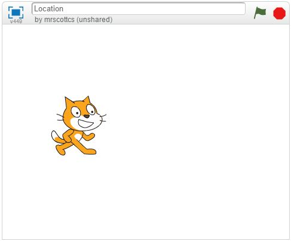
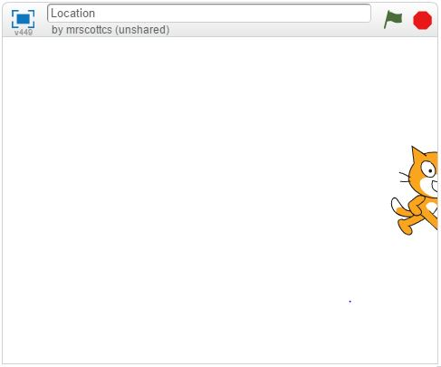
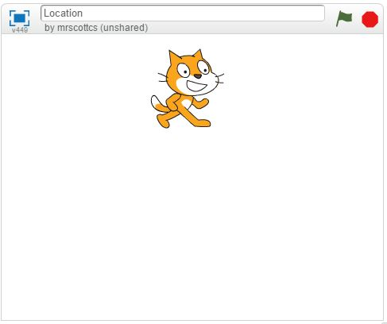
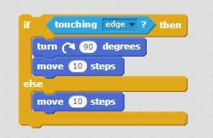

# Test Yourself: Scratch Basics (Not Weighted)

*Quiz*

**Points:** 4.0

## Questions

### Question 1

**Question**

Assuming a stage width of 480 and a stage height of 360, what is the current x-position of Scratch?

- [x] -120
- [ ] 0
- [ ] 120
- [ ] -240

### Question 2

**Question**

Assuming a stage width of 480 and a stage height of 360, what is the current y-position of Scratch?

- [x] 0
- [ ] 240
- [ ] 480
- [ ] 180

### Question 3

**Question**

Assuming a stage width of 480 and a stage height of 360, what is the current x-position of Scratch?

- [x] 0
- [ ] 120
- [ ] -120
- [ ] -240

### Question 4

**Question**

What type of program behavior would you expect to happen when the following script is manually activated?

- [x] Short movement by sprite and a possible rotation.
- [ ] Sprite will move back and forth across the screen.
- [ ] Sprite will move across screen and turn 90 to the right each time it hits a wall.
- [ ] No action
